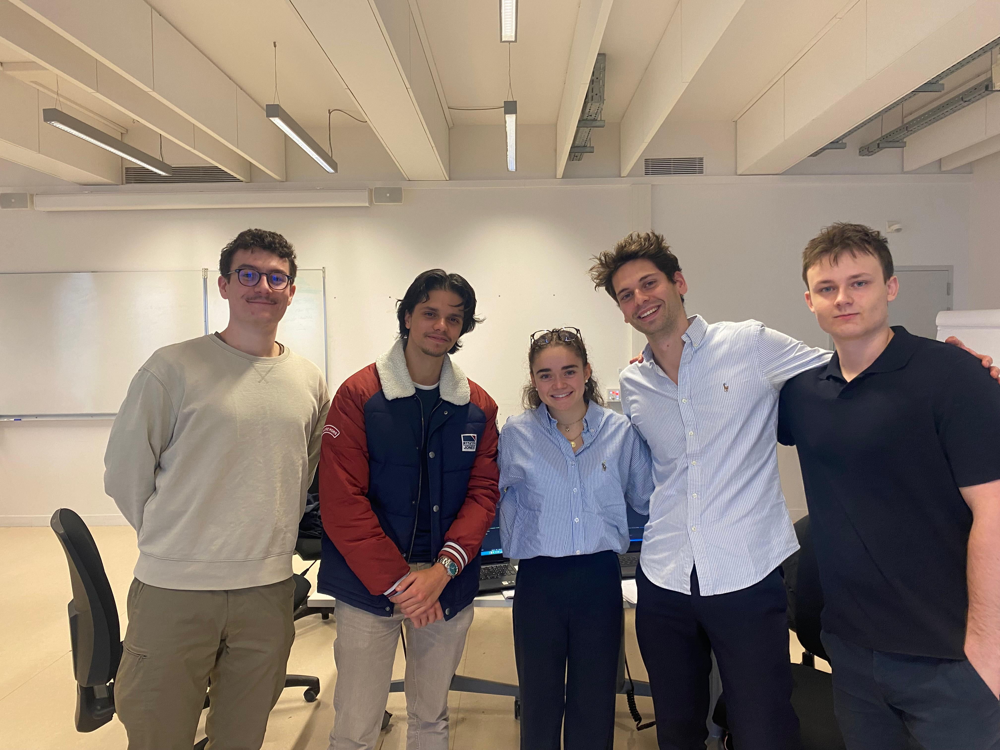

# Hackathon Hi Paris - 5th Edition

This repository contains our project developed during the **5th edition of the Hi Paris Hackathon**, held in **November 2024**.  
We participated as a team composed of:
- **Mila Marsot**
- **Marceau Leclerc**
- **Massyl Adjal**
- **Thibaut Boyenval**
- **Vincent Lagarde**

---

## Hackathon Topic 🌍
The challenge was to **predict groundwater table levels** using a dataset containing over 100 variables.  
The goal was to design a high-performing model to anticipate fluctuations in groundwater resources, a critical issue in the context of climate change.

---

## Team Performance 🏆
- 🥈 **2nd place** out of 60 participating teams.

---

## Repository Content 📂
- **`Leaderboard_2_Group_23.ipynb`**:  
  This notebook contains the final code used to train and validate our model. It includes:
  - Data preparation.
  - Preprocessing steps.
  - Model training and evaluation.
  - Final results obtained.

---

## Useful Links 🔗
- **Official Hackathon GitHub repository**:  
  [https://github.com/hi-paris/Hickathon5.git](https://github.com/hi-paris/Hickathon5.git)

---

## Team Photo 📸
Here is a photo of our team during the 5th edition of the Hi Paris Hackathon:  

